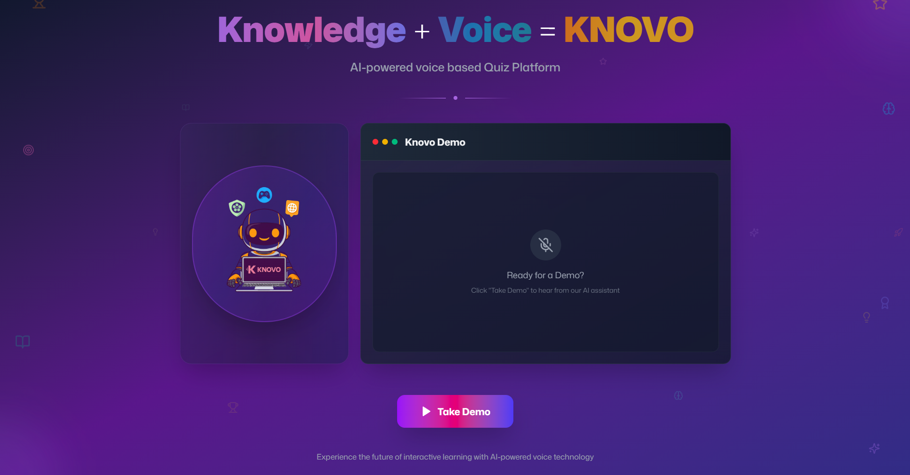
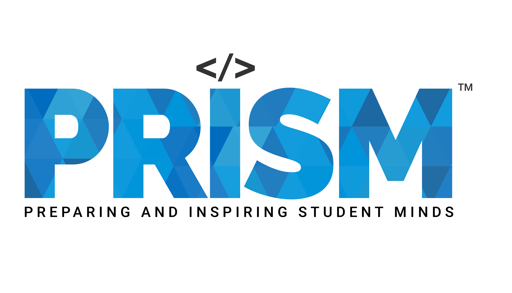
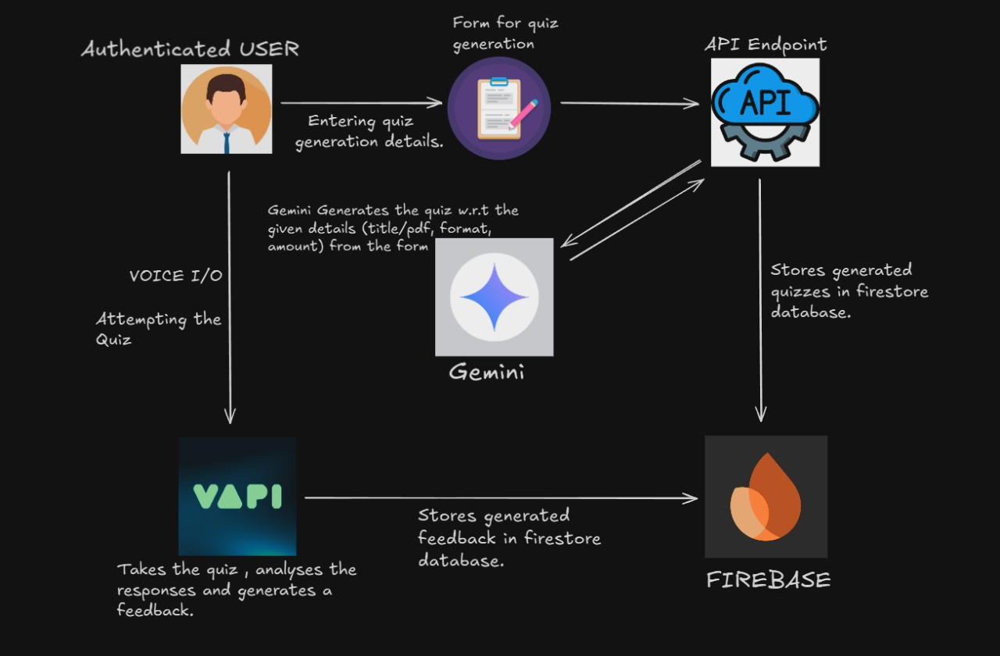

# 🚀 KNOVO = Knowledge + Voice - AI-powered Quiz Platform  

  

# 🏆 Built for the Prism GenAI Hackathon 2025 – Round 2  

🌐 **Live Deployment** → [Knovo App](https://knovo-dhlb.vercel.app)  

---

## 🌟 Overview  

Knovo transforms traditional quizzing into an **immersive, voice-driven learning experience**.  
Instead of static question banks, it dynamically generates quizzes from **titles, PDFs, or keywords** using **Gemini AI**. Learners attempt quizzes **through voice**, get **real-time adaptive feedback**, and track their performance via leaderboards.  

Our mission: **Make learning inclusive, engaging, and personalized** — for students, educators, and especially the **visually impaired** who benefit from a screen-free, hands-free quiz experience.  

---

## 🎯 Key Features  

- 🎤 **Voice-based Quizzing** – Converse with Ai Quizmaster with a live transcript that shows the whole conversation.  
- 📝 **Custom Quiz Generation** – Create quizzes via form-based input or voice prompts powered by Vapi Workflow and Google Gemini API.
- 📊 **Detailed Feedback** – Beyond accuracy: fluency, clarity, and articulation are analyzed. Gives an answer key table for Mcq and True/False based questions.  
- 👀 **Accessibility** – Voice-based workflows tailored for visually impaired learners and students of any age.  
- 👥 **Multiplayer & Leaderboards** – Each quiz has its own leaderboard with top 3 high scorers.  
- ⚡ **Challenge Modes** – Adaptive difficulty quizzes on specific topics or mixed sets, powered by **Vapi workflows**.  

---

## 👥 Stakeholders  

- **Students & Learners** → Engage learning with fun.  
- **Educators & Institutions** → Gamify learning & track progress.  
- **Visually Impaired Users** → Screen-free, accessible voice-first learning.  

---

## 🛠️ Tech Stack  

- **Frontend**: Next.js + TailwindCSS  
- **Backend**: Node.js  
- **AI/Voice**: Gemini API + Vapi SDK  
- **Database & Auth**: Firebase (Firestore DB + Auth)  
- **Hosting**: Vercel  
- **Version Control**: GitHub  

---

## ⚙️ Architecture  

1. **User Authentication** → Secure sign-in via Firebase Auth.  
2. **Quiz Generation** → Quizzes created dynamically from inputs (title, PDF, or voice) using Gemini API. Stored in Firestore DB.  
3. **Voice Interaction** → Users attempt quizzes through Vapi AI workflows (Deepgram ASR + 11labs transcription) with real-time analysis.  
4. **Adaptive Challenges** → Difficulty automatically adjusts after the first 5 questions on random topics to match the user’s level in Challenge Mode.  
5. **Feedback Page** → AI evaluates answers for accuracy, fluency, articulation, and clarity. Results are stored in Firestore DB.  
6. **Leaderboard** → Real-time score tracking per quiz, displaying top scorers and updating instantly.  

---

## 🎥 Demo  

- **Demo Video** → *(Add YouTube/Drive public link)*  
- **Live App** → [Knovo on Vercel](https://knovo-dhlb.vercel.app)  

---

## 📂 Submission Details  

- **Team Name**: The Immortals  
- **College**: VIT Vellore  
- **Theme**: Multimodal AI  
- **Team Lead**: Divesh Singh  

---

## ✅ Evaluation Highlights  

- **Working Prototype** – Fully functional voice based quiz platform.  
- **Technical Depth** – Multimodal AI :- Vapi workflows for voice based interaction and Gemini for dynamic quiz generation.  
- **UX** – Engaging and interactive with smooth UI.  
- **Accessibility** – Voice-based workflows for visually impaired users.  
- **Docs & Presentation** – Architecture, assumptions, claims and demo video provided.  

---
